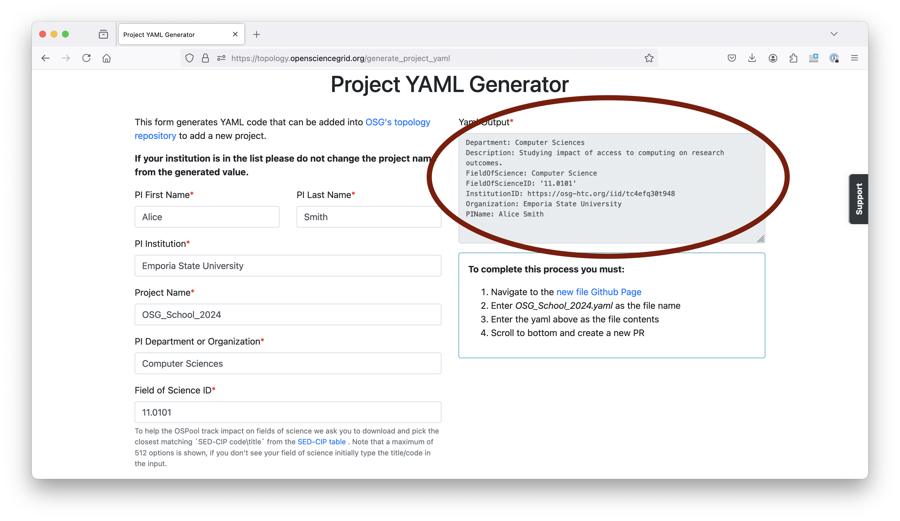

# Continue Your Access to the OSPool

Any US-based researcher can use the OSPool indefinitely, with no allocation 
or cost to you. To continue using your current account, submit information for a long-term 
project designation based on your research group; this will replace the temporary
"OSG School" project we have used this week. 

Please complete the following steps by September 20: 

1. Fill out the following form: [Project Creation Form](https://topology.opensciencegrid.org/generate_project_yaml)
	
	**Click on "Submit Manually" when done.** 
	If the project name doesn't auto-populate, just fill in `OSG_School_2024`. 
	
	The form looks like this: 
	
	
	
	This should be the option you choose at the end: 
	
	

1. Send an email to support@osg-htc.org with the following: 

	1. Include the text of the project creation form (see image below). 
	1. CC the PI of your research group, asking them to confirm your membership. 
	in their group. If you are the PI, that should be indicated in 
	the email. 

	Yaml output to include in the email: 
	
	

1. If you are not the PI of your research group, make sure your PI replies to 
your email to confirm that you are working with them!!

Once the project PI has confirmed your membership, OSG Facilitators will create a new 
project of the form `Institution_PIName`. You will receive
a notification when you are added to the new project, and a follow up email from 
the OSG faciliation team. 