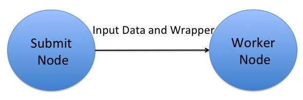

Data Exercise 1.2: transfer\_input\_files, transfer\_output\_files, and remaps
==================================================

Exercise Goal 
-------------

The objective of this exercise is to refresh yourself on HTCondor file
transfer, to implement file compression, and to begin examining the
memory and disk space used by your jobs in order to plan larger batches.
We will also explore ways to deal with output data.

Setup
-----

The executable we'll use in this exercise and later today is the same
`blastx` executable from previous exercises. Log in to ap40:

``` hl_lines="1"
$ ssh <USERNAME>@ap40.uw.osg-htc.org
```

Then change into the `blast-data` folder that you created in the
previous exercise.

### Review: HTCondor File Transfer



Recall that OSG does **NOT** have a shared filesystem! Instead,
HTCondor *transfers* your executable and input files (specified with
the `executable` and `transfer_input_files` submit file directives,
respectively) to a working directory on the execute node, regardless of
how these files were arranged on the submit node. In this exercise we'll
use the same `blastx` example job that we used previously, but modify
the submit file and test how much memory and disk space it uses on the
execute node.

Start with a test submit file
-----------------------------

We've started a submit file for you, below, which you'll add to in the remaining steps.

``` file
executable = 
transfer_input_files = 
output = test.out
error = test.err
log = test.log
request_memory = 
request_disk = 
request_cpus = 1
requirements = (OSGVO_OS_STRING == "RHEL 9")
queue
```

### Implement file compression

In our first blast job from the Software exercises ([1.1](../software/part4-ex1-download.md)), the database files in the `pdbaa` directory were all transferred, as is, but we
could instead transfer them as a single, compressed file using `tar`.
For this version of the job, let's compress our blast database files to send them to the submit node as a single
`tar.gz` file (otherwise known as a tarball), by following the below steps:

1.  Change into the `pdbaa` directory and compress the database files into a single file called `pdbaa_files.tar.gz`
    using the `tar` command.
    Note that this file will be different from the `pdbaa.tar.gz` file that you used earlier, because it will only
    contain the `pdbaa` files, and not the `pdbaa` directory, itself.)

    Remember, a typical command for creating a tar file is:

        :::console
        user@ap40 $ tar -cvzf <COMPRESSED FILENAME> <LIST OF FILES OR DIRECTORIES>


    Replacing `<COMPRESSED FILENAME>` with the name of the tarball that you would like to create and
    `<LIST OF FILES OR DIRECTORIES>` with a space-separated list of files and/or directories that you want inside pdbaa_files.tar.gz. 
    Move the resulting tarball to the `blast-data` directory.

2. Create a wrapper script that will first decompress the `pdbaa_files.tar.gz` file, and then run blast.

    Because this file will now be our `executable` in the submit file, we'll also end up transferring the `blastx` executable
    with `transfer_input_files`.
    In the `blast-data` directory, create a new file, called `blast_wrapper.sh`, with the following contents:

        :::file
        #!/bin/bash
        
        tar -xzvf pdbaa_files.tar.gz
        
        ./blastx -db pdbaa -query mouse.fa -out mouse.fa.result
        
        rm pdbaa.*

    Also remember to make the script executable: `chmod +x blast_wrapper.sh`

    !!! warning "Extra Files!"
        The last line removes the resulting database files that came from `pdbaa_files.tar.gz`, as these files would
        otherwise be copied back to the submit server as perceived output since they're "new" files that HTCondor
        didn't transfer over as input.

### List the executable and input files

Make sure to update the submit file with the following:

-   Add the new `executable` (the wrapper script you created above)
-   In `transfer_input_files`, list the `blastx` binary, the `pdbaa_files.tar.gz` file, and the input query file.

!!! note "Commas, commas everywhere!"
    Remember that `transfer_input_files` accepts a comma separated list of files, and that you need to list the full
    location of the `blastx` executable (`blastx`).
    There will be no arguments, since the arguments to the `blastx` command are now captured in the wrapper script.

### Predict memory and disk requests from your data

Also, think about how much memory and disk to request for this job.
It's good to start with values that are a little higher than you think a test job will need, but think about:

-   How much memory `blastx` would use if it loaded all of the database files *and* the query input file into memory.
-   How much disk space will be necessary on the execute server for the executable, all input files, and all output
    files (hint: the log file only exists on the submit node).
-   Whether you'd like to request some extra memory or disk space, just in case

Look at the `log` file for your `blastx` job from Software exercise ([1.1](../software/part4-ex1-download.md)), and compare the memory and disk "Usage" to what you predicted
from the files.
Make sure to update the submit file with more accurate memory and disk requests. You may still want to request slightly
more than the job actually used. 

Run the test job
----------------

Once you have finished editing the submit file, go ahead and submit the job.
It should take a few minutes to complete, and then you can check to make sure that no unwanted files (especially the
`pdbaa` database files) were copied back at the end of the job.

Run a **`du -sh`** on the directory with this job's input.
How does it compare to the directory from Software exercise ([1.1](../software/part4-ex1-download.md)), and why?

transfer\_output\_files
-----------------------

So far, we have used HTCondor's new file detection to transfer back
the newly created files. An alternative is to be explicit, using the
`transfer_output_files` attribute in the submit file. The upside to this
approach is that you can pick to only transfer back a subset of the
created files. The downside is that you have to know which files are
created.

The first exercise is to modify the submit file from the previous
example, and add a line like (remember, before the `queue`):

    :::file
    transfer_output_files = mouse.fa.result

You may also remove the last line in the `blast_wrapper.sh`, the
`rm pdbaa.*` as extra files are no longer an issue - those files
will be ignored because we used `transfer_output_files`.

Submit the job, and make sure everything works. Did you get
any `pdbaa.*` files back?

The next thing we should try is to see what happens if the
file we specify does not exist. Modify your submit file,
and change the `transfer_output_files` to:

    :::file
    transfer_output_files = elephant.fa.result

Submit the job and see how it behaves. Did it finish successfully?

transfer\_output\_remaps
------------------------

Related to `transfer_output_files` is `transfer_output_remaps`,
which allows us to rename outputs, or map the outputs to 
a different storage system (will be explored in the next
module).

The format of the `transfer_output_remaps` attribute is a
list of remaps, each remap taking the form of `src=dst`. 
The destination can be a local path, or a URL. For example:

    :::file
    transfer_output_remaps = "myresults.dat = s3://destination-server.com/myresults.dat"

If you have more than one remap, you can separate them with
`;`

By now, your `blast-data` directory is probably starting
to look messy with a mix of submit files, input data,
log file and output data all intermingled. One improvement
could be to map our outputs to a separate directory. Create
a new directory named `science-results`. 

Add a `transfer_output_remaps` line to the submit file.
It is common to place this line right after the
`transfer_output_files` line. Change the 
`transfer_output_files` back to `mouse.fa.result`.
Example:

    ::file
    transfer_output_files = mouse.fa.result
    transfer_output_remaps = 

Fill out the remap line, mapping `mouse.fa.result` to the
destination `science-results/mouse.fa.result`. Remember
that the `transfer_output_remaps` value requires double
quotes around it.

Submit the job, and wait for it to complete. Are there
any errors? Can you find mouse.fa.result?

Conclusions
-----------

In this exercise, you:

-   Used your data requirements knowledge from the [previous exercise](part1-ex1-data-needs.md) to write a job.
-   Executed the job on a remote worker node and took note of the data usage.
-   Used `transfer_input_files` to transfer inputs
-   Used `transfer_output_files` to transfer outputs
-   Used `transfer_output_remaps` to map outputs to a different destination

When you've completed the above, continue with the [next exercise](part1-ex3-blast-split.md).

