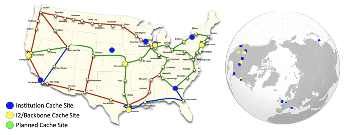

Data Exercise 2.1: Using OSDF for Large Shared Data
===================================================

This exercise will use a [BLAST](http://blast.ncbi.nlm.nih.gov/Blast.cgi?CMD=Web&PAGE_TYPE=BlastHome) workflow to
demonstrate the functionality of OSDF for transferring input files to jobs on OSG.

Because our individual blast jobs from previous exercises would take a bit longer
with a larger database (too long for an workable exercise), we'll imagine for this exercise that our
`pdbaa_files.tar.gz` file is too large for `transfer_input_files` (larger than ~1 GB).
For this exercise, we will use the same inputs, but instead of using `transfer_input_files` for the `pdbaa` database,
we will place it in OSDF and have the jobs download from there.

OSDF is connected to a distributed set of caches spread across the U.S.
They are connected with high bandwidth connections to each other, and to the data origin servers, where your data is
originally placed.

Setup
-----

-   Make sure you're logged in to `ap40.uw.osg-htc.org`
-   Copy the following files from the previous Blast exercises to a new directory in `/home/<username>` called `osdf-shared`:
    - `blast_wrapper.sh`
    - `blastx`
    - `mouse_rna.fa.1`
    - `mouse_rna.fa.2`
    - `mouse_rna.fa.3`
    - Your most recent submit file (probably named `blast_split.sub`)

Place the Database in OSDF
--------------------------------

### Copy to your data to the OSDF space

OSDF provides a directory for you to store data which can be accessed through the caching servers.
First, you need to move your BLAST database (`pdbaa_files.tar.gz`) into this directory. For `ap40.uw.osg-htc.org`, the directory
to use is `/ospool/ap40/data/[USERNAME]/`

Note that files placed in the `/ospool/ap40/data/[USERNAME]/` directory will only be accessible
by your own jobs.

Modify the Submit File and Wrapper
----------------------------------

You will have to modify the wrapper and submit file to use OSDF:

1. HTCondor knows how to do OSDF transfers, so you just have to provide the correct URL in 
   `transfer_input_files`. Note there is no servername (3 slashes in :///) and we instead
   is is just based on namespace (`/ospool/ap40` in this case):

        ::file
        transfer_input_files = blastx, $(inputfile), osdf:///ospool/ap40/data/[USERNAME]/pdbaa_files.tar.gz

1. Confirm that your queue statement is correct for the current directory. It should be something like:

        ::file
        queue inputfile matching mouse_rna.fa.*

And that `mouse_rna.fa.*` files exist in the current directory (you should have copied a few them from the previous exercise
directory).

Submit the Job
--------------

Now submit and monitor the job! If your 100 jobs from the previous exercise haven't started running yet, this job will
not yet start.
However, after it has been running for ~2 minutes, you're safe to continue to the next exercise!

Considerations
--------------

1. Why did we not place all files in OSDF (for example, `blastx` and `mouse_rna.fa.*`)?

1. What do you think will happen if you make changes to `pdbaa_files.tar.gz`? Will the caches
   be updated automatically, or is there a possiblility that the old version of
   `pdbaa_files.tar.gz` will be served up to jobs? What is the solution to this problem?
   (Hint: OSDF only considers the filename when caching data)

Note: Keeping OSDF 'Clean'
--------------------------------

Just as for any data directory, it is VERY important to remove old files from OSDF when you no longer need them,
especially so that you'll have plenty of space for such files in the future.
For example, you would delete (`rm`) files from `/ospool/ap40/data/[USERNAME]/` on when you don't need them there
anymore, but only after all jobs have finished.
The next time you use OSDF after the school, remember to first check for old files that you can delete.

Next exercise
-------------

Once completed, move onto the next exercise: [Using OSDF for outputs](part2-ex2-osdf-outputs.md)

