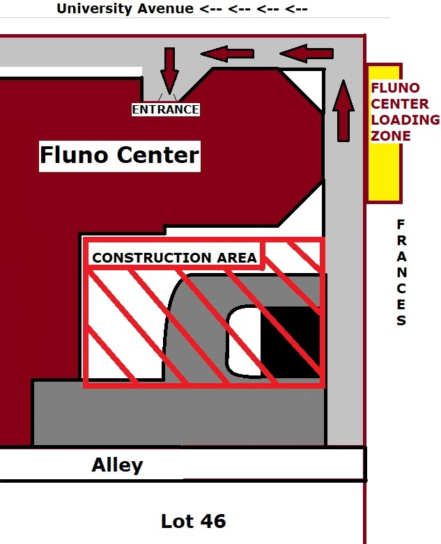

## August 4 (Sunday)

Welcome Dinner for Participants and Staff

All School participants and staff are encourage to attend!

**Time:** Starting at 6:30 p.m. 
**Location**: [Fluno Center](https://fluno.com), 601 University Avenue; Skyview Room, 8th floor

<!--
There is construction all around the Fluno Center;
use the map below to get to the entrance on University Avenue:

Rachel, one of the School staff, will be in the hotel lobby to lead a group walking to the Fluno.
She plans to arrive at the Park Hotel at about 5:40 p.m.,
and then the whole group will leave at about 6:00 p.m.
Join the walking group, if you like!

Otherwise, you are welcome to walk on your own,
to get a ride (maybe even the hotel shuttle will be available),
or to get there however you like.
-->

## August 5 (Monday)

<table>
  <thead>
    <tr>
      <th>Start</th>
      <th>End</th>
      <th>Event</th>
      <th>Instructor</th>
    </tr>
  </thead>
  <tbody>
    <tr>
      <td>8:00</td>
      <td>8:45</td>
      <td>Breakfast in Computer Sciences 1240</td>
      <td>-</td>
    </tr>
    <tr>
      <td>9:00</td>
      <td>9:15</td>
      <td>Welcome to the OSG School</td>
      <td>Tim C.</td>
    </tr>
    <tr>
      <td>9:15</td>
      <td>9:30</td>
      <td>Lecture: Introduction to High Throughput Computing</td>
      <td>Christina</td>
    </tr>
    <tr>
      <td>9:30</td>
      <td>9:45</td>
      <td>Exercise: Scaling Out Computing Worksheet</td>
      <td>-</td>
    </tr>
    <tr>
      <td>9:45</td>
      <td>10:15</td>
      <td>Lecture: Introduction to HTCondor</td>
      <td>Andrew</td>
    </tr>
    <tr>
      <td>10:15</td>
      <td>10:30</td>
      <td>Exercise: Log in</td>
      <td>-</td>
    </tr>
    <tr>
      <td>10:30</td>
      <td>10:45</td>
      <td>Break</td>
      <td>-</td>
    </tr>
    <tr>
      <td>10:45</td>
      <td>12:15</td>
      <td>Exercises: HTCondor basics (1.n series)</td>
      <td>-</td>
    </tr>
    <tr>
      <td>12:15</td>
      <td>13:15</td>
      <td>Lunch in Computer Sciences (near 1240)</td>
      <td>-</td>
    </tr>
    <tr>
      <td>13:15</td>
      <td>14:00</td>
      <td>Lecture: More HTCondor</td>
      <td>Andrew</td>
    </tr>
    <tr>
      <td>14:15</td>
      <td>15:00</td>
      <td>Exercises: Many jobs (2.n series)</td>
      <td>-</td>
    </tr>
    <tr>
      <td>15:00</td>
      <td>15:15</td>
      <td>Break</td>
      <td>-</td>
    </tr> 
    <tr>
      <td>15:15</td>
      <td>15:30</td>
      <td>Lecture: Setting goals for the School and beyond</td>
      <td>Rachel</td>
    </tr>
    <tr>
      <td>15:30</td>
      <td>17:00</td>
      <td>
        Exercises: Goals and unfinished exercises 
        Individual consultations
      </td>
      <td>-</td>
    </tr>
    <tr>
      <td>19:00</td>
      <td>20:30</td>
      <td>
        Evening work session (optional) 
        Memorial Union – Council Room (4th Floor) 
        <strong>Note:</strong> Free, outdoor showing of Jaws (1975) at 9 p.m.!
      </td>
      <td>Rachel, Christina, Tim</td>
    </tr>
  </tbody>
</table>

## August 6 (Tuesday)

<table>
  <thead>
    <tr>
      <th>Start</th>
      <th>End</th>
      <th>Event</th>
      <th>Instructor</th>
    </tr>
  </thead>
  <tbody>
    <tr>
      <td>8:00</td>
      <td>8:45</td>
      <td>Breakfast in Computer Sciences 1240</td>
      <td>-</td>
    </tr>
    <tr>
      <td>9:00</td>
      <td>9:45</td>
      <td>Lecture: Introduction to dHTC and the OSPool</td>
      <td>Tim C.</td>
    </tr>
    <tr>
      <td>9:45</td>
      <td>10:30</td>
      <td>Exercises: Using the OSPool</td>
      <td>-</td>
    </tr>
    <tr>
      <td>10:30</td>
      <td>10:45</td>
      <td>Break Travel document collection, as needed</td>
      <td>-</td>
    </tr>
    <tr>
      <td>10:45</td>
      <td>11:30</td>
      <td>Lecture: Troubleshooting jobs</td>
      <td>Showmic</td>
    </tr>
    <tr>
      <td>11:30</td>
      <td>12:15</td>
      <td>Exercises: Basic troubleshooting tools</td>
      <td>-</td>
    </tr>
    <tr>
      <td>12:15</td>
      <td>13:30</td>
      <td>Lunch in Computer Sciences (near 1240) <strong>13:15:</strong> Return documents in 1240</td>
      <td>-</td>
    </tr>
    <tr>
      <td>13:30</td>
      <td>14:45</td>
      <td>Interactive: High Throughput Computing in action</td>
      <td>staff</td>
    </tr>
    <tr>
      <td>14:45</td>
      <td>15:00</td>
      <td>Break</td>
      <td>-</td>
    </tr>
    <tr>
      <td>15:00</td>
      <td>15:45</td>
      <td>Lecture: Software portability</td>
      <td>Rachel</td>
    </tr>
    <tr>
      <td>15:45</td>
      <td>17:00</td>
      <td>
        Exercises: Software and unfinished exercises 
        Individual consultations
      </td>
      <td>staff</td>
    </tr>
    <tr>
      <td>19:00</td>
      <td>20:30</td>
      <td>
        Evening work session (optional) 
        Memorial Union – Council Room (4th Floor)
      </td>
      <td>Christina, Amber, Tim</td>
    </tr> 
  </tbody>
</table>

## August 7 (Wednesday)

<table>
  <thead>
    <tr>
      <th>Start</th>
      <th>End</th>
      <th>Event</th>
      <th>Instructor</th>
    </tr>
  </thead>
  <tbody>
    <tr>
      <td>8:00</td>
      <td>8:45</td>
      <td>Breakfast in Computer Sciences 1240</td>
      <td>-</td>
    </tr>
    <tr>
      <td>9:00</td>
      <td>9:45</td>
      <td>Lecture: Working with data</td>
      <td>Andrew</td>
    </tr>
    <tr>
      <td>9:45</td>
      <td>10:45</td>
      <td>Exercises: Data</td>
      <td>-</td>
    </tr>
    <tr>
      <td>10:45</td>
      <td>11:00</td>
      <td>Break</td>
      <td>-</td>
    </tr>
    <tr>
      <td>11:00</td>
      <td>12:00</td>
      <td>
        HTC Showcase Part 1 
        &#9654; Michael Gerard;
        Nuclear Engineering &amp; Engineering Physics 
        
“Using CHTC to optimize the Helically Symmetric eXperiment stellarator”

        &#9654; Bryce Johnson;
        Morgridge Institute for Research & UW&ndash;Madison Computer Sciences 
        
“Running millions of biophysical simulations with OSPool”

      </td>
      <td>-</td>
    </tr>
    <tr>
      <td>12:00</td>
      <td>12:30</td>
      <td>Open Q&amp;A and discussion time</td>
      <td>staff</td>
    </tr>
    <tr>
      <td>12:30</td>
      <td>13:45</td>
      <td>
        Lunch in Computer Sciences (near 1240) 
        Optional Domain Lunches: Christina (math); Rachel (biology); Andrew/Amber (chemistry);
        Ian (ML); Tim (physics &amp; astronomy)
      </td> 
      <td>-</td>
    </tr>
    <tr>
      <td>13:45</td>
      <td>17:00</td>
      <td>
        Afternoon off &mdash; <a href="../logistics/fun-day">suggestions for fun</a> 
        Or, optional work time 
        Or, individual consultations
      </td>
      <td>staff</td>
    </tr>
    <tr>
      <td>19:00</td>
      <td>20:30</td>
      <td>
        Evening work session (optional) 
        Memorial Union – Langdon Room (4th Floor) 
      </td>
      <td>Christina, Showmic</td>
    </tr>
  </tbody>
</table>

## August 8 (Thursday)

<table>
  <thead>
    <tr>
      <th>Start</th>
      <th>End</th>
      <th>Event</th>
      <th>Instructor</th>
    </tr>
  </thead>
  <tbody>
    <tr>
      <td>8:00</td>
      <td>8:45</td>
      <td>Breakfast in Computer Sciences 1240</td>
      <td>-</td>
    </tr>
    <tr>
      <td>9:00</td>
      <td>9:45</td>
      <td>Lecture: Independence in Research Computing</td>
      <td>Christina</td>
    </tr>
    <tr>
      <td>9:45</td>
      <td>10:45</td>
      <td>Exercises: Scaling up</td>
      <td>-</td>
    </tr>
    <tr>
      <td>10:45</td>
      <td>11:00</td>
      <td>Break</td>
      <td>-</td>
    </tr>
    <tr>
      <td>11:00</td>
      <td>12:00</td>
      <td>Lecture: DAGMan</td>
      <td>Rachel</td>
    </tr>
    <tr>
      <td>12:00</td>
      <td>13:15</td>
      <td>Lunch in Computer Sciences (near 1240)</td>
      <td>-</td>
    </tr>
    <tr>
      <td>13:15</td>
      <td>14:30</td>
      <td>
        Exercises: DAGMan 
        Work Time: Apply HTC to own research 
        Individual consultations
      </td>
      <td>staff</td>
    </tr>
    <tr>
      <td>14:30</td>
      <td>14:45</td>
      <td>Break</td>
      <td>-</td>
    </tr>
    <tr>
      <td>14:45</td>
      <td>15:45</td>
      <td>
        Work Time: Apply HTC to own research 
        Individual consultations
      </td>
      <td>staff</td>
    </tr>
    <tr>
      <td>15:45</td>
      <td>16:30</td>
      <td>Lecture: Machine Learning</td>
      <td>Ian</td>
    </tr>
    <tr>
      <td>19:00</td>
      <td>20:30</td>
      <td>
        Evening work session (optional) 
        Memorial Union – Council Room (4th Floor) 
      </td>
      <td>Andrew, Showmic, Tim</td>
    </tr>
  </tbody>
</table>

## August 9 (Friday)

<table>
  <thead>
    <tr>
      <th>Start</th>
      <th>End</th>
      <th>Event</th>
      <th>Instructor</th>
    </tr>
  </thead>
  <tbody>
    <tr>
      <td>8:00</td>
      <td>8:45</td>
      <td>Breakfast in Computer Sciences 1240</td>
      <td>-</td>
    </tr>
    <tr>
      <td>9:00</td>
      <td>9:45</td>
      <td>
        <strong>Optional</strong> Lecture: Self-Checkpointing 
        Work Time: Apply HTC to own research
      </td>
      <td>Showmic</td>
    </tr>
    <tr>
      <td>9:45</td>
      <td>10:30</td>
      <td>
        Work time: Apply HTC to own research 
        Individual consultations
      </td>
      <td>staff</td>
    </tr>
    <tr>
      <td>10:30</td>
      <td>10:45</td>
      <td>Break</td>
      <td>-</td>
    </tr>
    <tr>
      <td>10:45</td>
      <td>11:30</td>
      <td>Work time: Apply HTC to own research </td>
      <td>-</td>
    </tr>
    <tr>
      <td>11:30</td>
      <td>11:50</td>
      <td>Group photo (details TBD)</td>
      <td>-</td>
    </tr>
    <tr>
      <td>11:50</td>
      <td>13:00</td>
      <td>
        Lunch, Computer Sciences (Staff to direct) 
        Optional: Introduction to Research Computing Facilitation
      </td>
      <td>Christina</td>
    </tr>
    <tr>
      <td>13:00</td>
      <td>14:00</td>
      <td>
        HTC Showcase, Part 2
         
        &#9654; Dan Wright;
        Civil &amp; Environmental Engineering 
        
“Computational hydroclimate research enabled by HTC”

        &#9654; Saloni Bhogale; 
        
“TBD”

      </td>
      <td>-</td>
    </tr>
    <tr>
      <td>14:00</td>
      <td>14:30</td>
      <td>
        Open Q&A 
        Work time: Apply HTC to own research 
        Break
      </td>
      <td>-</td>
    </tr>
    <tr>
      <td>14:30</td>
      <td>15:30</td>
      <td>Lightning talks by volunteer participants</td>
      <td>Attendees</td>
    </tr>
    <tr>
      <td>15:30</td>
      <td>16:00</td>
      <td>Open Q&amp;A and work time</td>
      <td>staff</td>
    </tr>
    <tr>
      <td>16:00</td>
      <td>16:45</td>
      <td>HTC and HTCondor Philosophy</td>
      <td>Miron (and Greg?)</td>
    </tr>
    <tr>
      <td>16:45</td>
      <td>17:15</td>
      <td>Lecture: Forward</td>
      <td>Tim</td>
    </tr>
  </tbody>
</table>

**Closing Dinner for Participants and Staff**

*   **Location:** Union South (next to Computer Sciences), indoors/outdoors
*   **Time:** 6:00&ndash;7:45 p.m. (or so)

We have scheduled a buffet dinner to wrap up the School.
The buffet itself, and some tables, are inside.
But if the weather is good, we will have easy access to outdoor space, too, and
we encourage everyone to head outside with their food.
